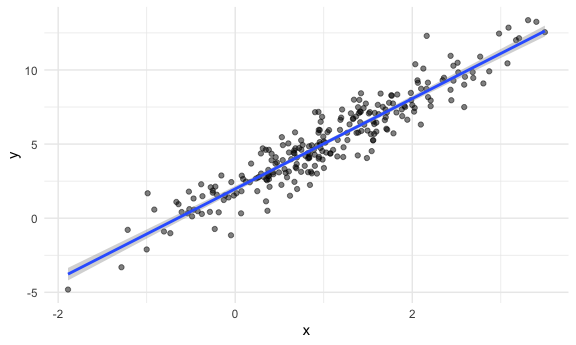
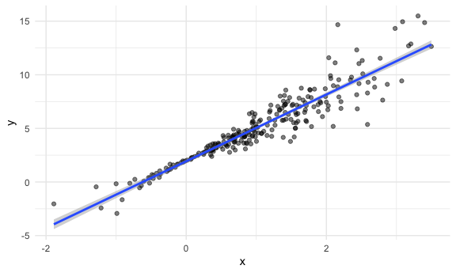
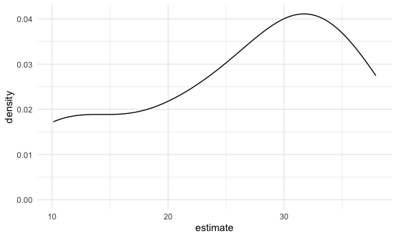

Bootstrap
================
Linshan Xie
2024-10-24

``` r
library(ggplot2)
knitr::opts_chunk$set(
  fig.width = 6,
  fig.asp = .6,
  out.width = "90%"
)

theme_set(theme_minimal()+theme(legend.position = "bottom"))

options(
  ggplot2.continuous.colour = "viridis",
  ggplot2.continuous.fill = "viridis")

scale_colour_discrete = scale_colour_viridis_d
scale_fill_discrete = scale_fill_viridis_d
```

Load the key packages.

``` r
library(tidyverse)
```

    ## ── Attaching core tidyverse packages ──────────────────────── tidyverse 2.0.0 ──
    ## ✔ dplyr     1.1.4     ✔ readr     2.1.5
    ## ✔ forcats   1.0.0     ✔ stringr   1.5.1
    ## ✔ lubridate 1.9.3     ✔ tibble    3.2.1
    ## ✔ purrr     1.0.2     ✔ tidyr     1.3.1
    ## ── Conflicts ────────────────────────────────────────── tidyverse_conflicts() ──
    ## ✖ dplyr::filter() masks stats::filter()
    ## ✖ dplyr::lag()    masks stats::lag()
    ## ℹ Use the conflicted package (<http://conflicted.r-lib.org/>) to force all conflicts to become errors

``` r
library(modelr)
library(p8105.datasets)

set.seed(1)
```

do some bootstrapping!

make up some data

``` r
n_samp = 250

sim_df_constant = 
  tibble(
    x = rnorm(n_samp, 1, 1),
    error = rnorm(n_samp, 0, 1),
    y = 2 + 3 * x + error
  )

sim_df_nonconstant = sim_df_constant |> 
  mutate(
  error = error * .75 * x,
  y = 2 + 3 * x + error
)
```

Let’s look at these

``` r
sim_df_constant |>
  ggplot(aes(x = x, y = y)) +
  geom_point(alpha = .5) +
  stat_smooth(method = "lm")
```

    ## `geom_smooth()` using formula = 'y ~ x'



``` r
sim_df_nonconstant |>
  ggplot(aes(x = x, y = y)) +
  geom_point(alpha = .5) +
  stat_smooth(method = "lm")
```

    ## `geom_smooth()` using formula = 'y ~ x'



Look at regression result

``` r
sim_df_constant |>
  lm(y ~ x, data = _) |>
  broom::tidy() |>
  knitr::kable(digit = 3)
```

| term        | estimate | std.error | statistic | p.value |
|:------------|---------:|----------:|----------:|--------:|
| (Intercept) |    1.977 |     0.098 |    20.157 |       0 |
| x           |    3.045 |     0.070 |    43.537 |       0 |

``` r
sim_df_nonconstant |>
  lm(y ~ x, data = _) |>
  broom::tidy() |>
  knitr::kable(digit = 3)
```

| term        | estimate | std.error | statistic | p.value |
|:------------|---------:|----------:|----------:|--------:|
| (Intercept) |    1.934 |     0.105 |    18.456 |       0 |
| x           |    3.112 |     0.075 |    41.661 |       0 |

## draw a bootstrap sample

``` r
boot_sample = function(df) {
  boot_df = 
    sample_frac(df, replace = TRUE) |>
    arrange(x)
  return(boot_df)
}
```

try running this

``` r
sim_df_nonconstant |>
  boot_sample() |>
  ggplot(aes(x = x, y = y)) +
  geom_point(alpha = .5) +
  stat_smooth(method = "lm")
```

    ## `geom_smooth()` using formula = 'y ~ x'


can we do this as a part of an analysis

``` r
sim_df_nonconstant |>
  boot_sample() |>
  lm(y ~ x, data = _) |>
  broom::tidy() |>
  knitr::kable(digit = 3)
```

| term        | estimate | std.error | statistic | p.value |
|:------------|---------:|----------:|----------:|--------:|
| (Intercept) |    1.896 |     0.098 |    19.311 |       0 |
| x           |    3.142 |     0.069 |    45.636 |       0 |

## Bootstrap a lot

``` r
boot_straps =
  tibble(
    strap_number = 1:1000
  ) |>
  mutate(
    strap_samp = map(strap_number, \(i) boot_sample(df = sim_df_nonconstant)),
    models = map(strap_samp, \(df) lm(y ~ x, data = df)),
    result = map(models, broom::tidy))
```

``` r
bootstrap_result = 
  boot_straps |>
  select(strap_number, result) |>
  unnest(result) |>
  group_by(term) |>
  summarize(
    boot_se = sd(estimate)
  ) |>
  knitr::kable(digits = 3)
```

do this all using modelr

``` r
boot_straps = 
  sim_df_nonconstant |>
  modelr::bootstrap(1000) |>
  mutate(
    strap = map(strap, as_tibble),
    models = map(strap, \(df) lm(y ~ x, data = df)),
    results = map(models, broom::tidy)
  ) |>
  select(.id, results) |>
  unnest(results)
```

## what you want to report

``` r
boot_straps |>
  group_by(term) |>
  summarize(
    boot_est = mean(estimate),
    boot_se = sd(estimate),
    boot_ci_ll = quantile(estimate, 0.025),
    boot_ci_ul = quantile(estimate, 0.975)
  )
```

    ## # A tibble: 2 × 5
    ##   term        boot_est boot_se boot_ci_ll boot_ci_ul
    ##   <chr>          <dbl>   <dbl>      <dbl>      <dbl>
    ## 1 (Intercept)     1.93  0.0762       1.79       2.08
    ## 2 x               3.11  0.104        2.92       3.32

## Look at the airbnb data

``` r
data("nyc_airbnb")

manhattan_df = 
  nyc_airbnb |> 
  mutate(stars = review_scores_location / 2) |> 
  rename(
    borough = neighbourhood_group,
    neighborhood = neighbourhood) |> 
  filter(borough == "Manhattan") |> 
  drop_na(price, stars) |> 
  select(price, stars, room_type)
```

plot the data

``` r
manhattan_df |>
  ggplot(aes(x = stars, y = price)) +
  geom_point() +
  stat_smooth(method = "lm", se = FALSE)
```

    ## `geom_smooth()` using formula = 'y ~ x'


fit a regression

``` r
manhattan_df |>
  lm(price ~ stars + room_type, data = _) |>
  broom::tidy() |>
  knitr::kable(digits = 3)
```

| term                  | estimate | std.error | statistic | p.value |
|:----------------------|---------:|----------:|----------:|--------:|
| (Intercept)           |   95.694 |    22.186 |     4.313 |       0 |
| stars                 |   27.110 |     4.585 |     5.913 |       0 |
| room_typePrivate room | -124.188 |     3.464 |   -35.848 |       0 |
| room_typeShared room  | -153.635 |    10.052 |   -15.285 |       0 |

bootstrap for better inference

``` r
manhattan_df |>
  modelr::bootstrap(10) |>
  mutate(strap = map(strap, as_tibble),
         models = map(strap, \(df) lm(price ~ stars + room_type, data = df)),
         results = map(models, broom::tidy)) |>
  select(.id, results) |>
  unnest(results) |>
  filter(term == "stars") |>
  ggplot(aes(estimate)) +
  geom_density()
```


